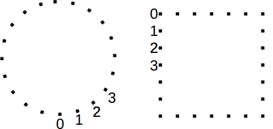

# knitter

knitter is an open software to generate a circular/square knitting pattern from a picture.
 
The method is inspired by the work of [Petros Vrellis](http://artof01.com/vrellis/works/knit.html).

## Uses and Derivatives

* http://imgur.com/gallery/pN5T9
* https://github.com/MaloDrougard/knit

# How to use it

1. Clone the repository (or just download [knitter.pde](https://raw.githubusercontent.com/christiansiegel/knitter/master/knitter.pde))
2. Copy your square, grayscale image into the same folder as the `knitter.pde` and name it `image.jpg`.
3. Open `knitter.pde` with the [Processing IDE](https://processing.org/).
4. Modify the configuration parameters at the top of the file (optional). You can also choose between *CIRCLE* and a *SQUARE* mode here.
5. Run Sketch.
6. Find the best parameters using the sliders.

# Output

## Visual Preview

While running the Sketch, a simulated result is shown in the window.

## Instructions

The knitting order is printed to the console and saved to `instruction.txt`. 

```
String #1454 -> next pin: 84
String #1455 -> next pin: 122
String #1456 -> next pin: 154
String #1457 -> next pin: 128
String #1458 -> next pin: 80
String #1459 -> next pin: 14
String #1460 -> next pin: 83
```

Furthermore, an interactive HTML page displaying and reading the single steps is generated and saved to `instruction.html`.

The pins are numbered counter-clockwise starting from 0:



## Thread Length

To have an estimate how much thread is needed, the total length is printed to the console in the end.

```
Total thread length: 1543 m
```

# Screenshot

An example result of running the current algorithm: 


