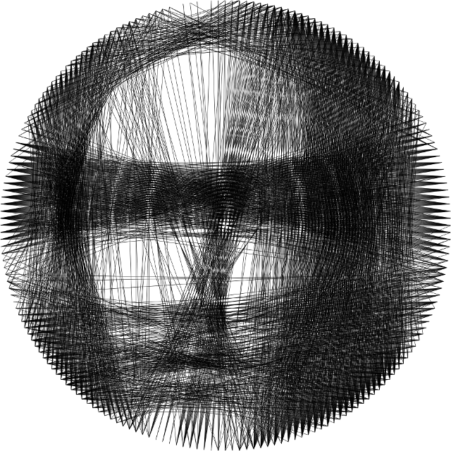

# knitter

knitter is an open software to generate a circular knitting pattern from a picture.
 
The method is inspired by the work of [Petros Vrellis](http://artof01.com/vrellis/works/knit.html).

*!! To this point, knitter is in development and doesn't produce satisfying results !!*

# How to use it

Clone the repository, modify the constant parameters in `knitter.cpp`, build and run it with
```
cd knitter
mkdir build
cd build
cmake ..
make
./knitter
```

# Output

The knitting order is printed to the console like

```
String #1454 -> next hook: 84
String #1455 -> next hook: 122
String #1456 -> next hook: 154
String #1457 -> next hook: 128
String #1458 -> next hook: 80
String #1459 -> next hook: 14
String #1460 -> next hook: 83
```

While running, two windows show the progress. In the end a `result.png`, containing the simulated result, is saved in the application's folder.

An example result of running the current algorithm on El Greco’s Christ: 


