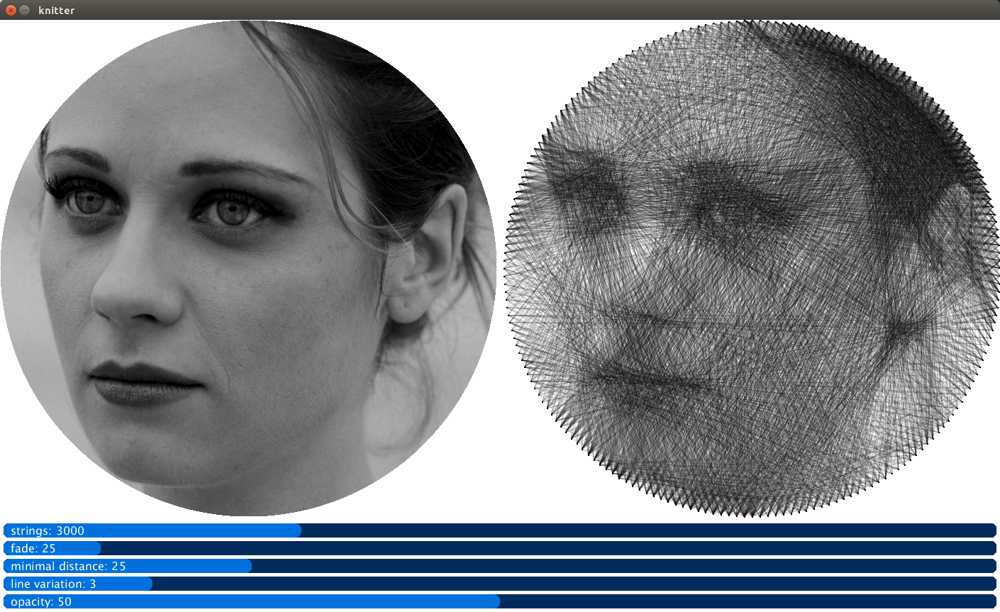

# knitter

knitter is an open software to generate a circular knitting pattern from a picture.
 
The method is inspired by the work of [Petros Vrellis](http://artof01.com/vrellis/works/knit.html).

*!! Under development !!*

# How to use it

1. Clone the repository (or just download [knitter.pde](https://raw.githubusercontent.com/christiansiegel/knitter/master/knitter.pde))
2. Open with [Processing](https://processing.org/).
3. Modify the configuration parameters at the top of the file.
4. Run Sketch.
5. Find the best parameters using the sliders.

# Output

While running, a simulated result is shown in the window.
The knitting order is printed to the console like

```
String #1454 -> next pin: 84
String #1455 -> next pin: 122
String #1456 -> next pin: 154
String #1457 -> next pin: 128
String #1458 -> next pin: 80
String #1459 -> next pin: 14
String #1460 -> next pin: 83
```

An example result of running the current algorithm: 


